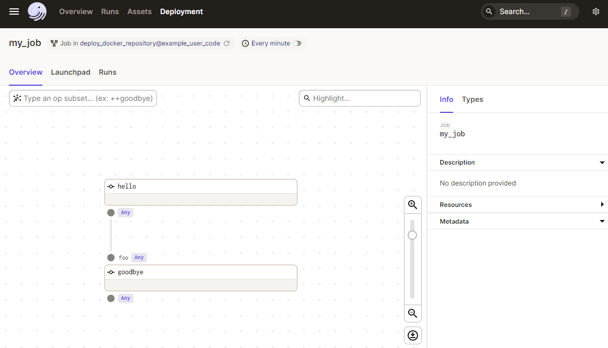

# Dagster on Elestio

This is a minimal example of a Dagster.

Click on the button below to deploy this repository with CI/CD on Elestio:

<a href="https://dash.elest.io/deploy?source=cicd&social=Github&url=https://github.com/elestio-examples/dagster"></a>



<br/>
<br/>

# Steps to clone this repository and run locally

### Step 1: Clone this repository

```
git clone YOUR_REPOSITORY_URL
```

### Step 2: Make some changes and push

Try to make some change in your Dagster project.

For that you can go to the `app folder`, and you can create, modify your project.

Don't forget to update your docker-compose.yml file if you need.

Save your changes and push to your git repository.

After few seconds to few minutes your change will be deployed on your CI/CD target 🚀

For more informations, go to the documentation.

    https://docs.dagster.io/getting-started

### Step 3: UI

You can open Dragster UI here:

    URL: https://[CI_CD_DOMAIN]
    email: root
    password: [ADMIN_PASSWORD]
